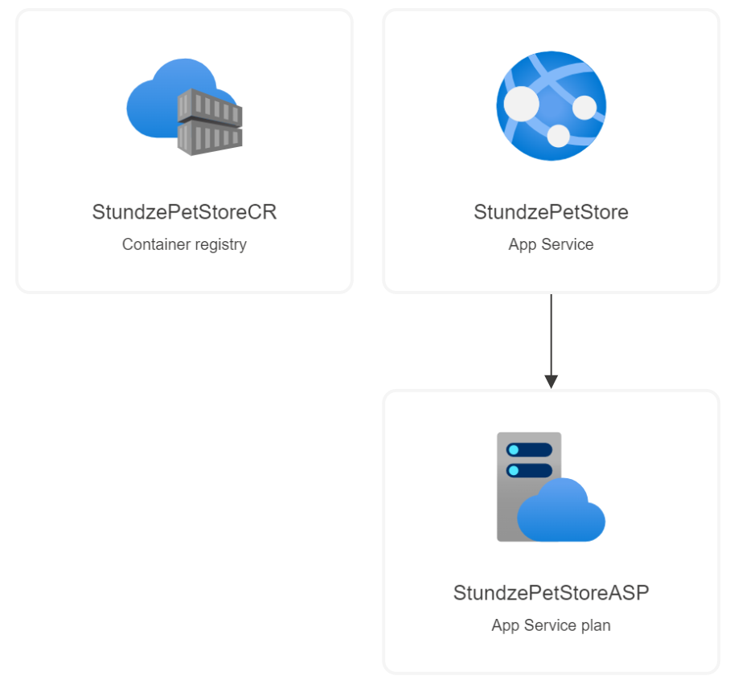
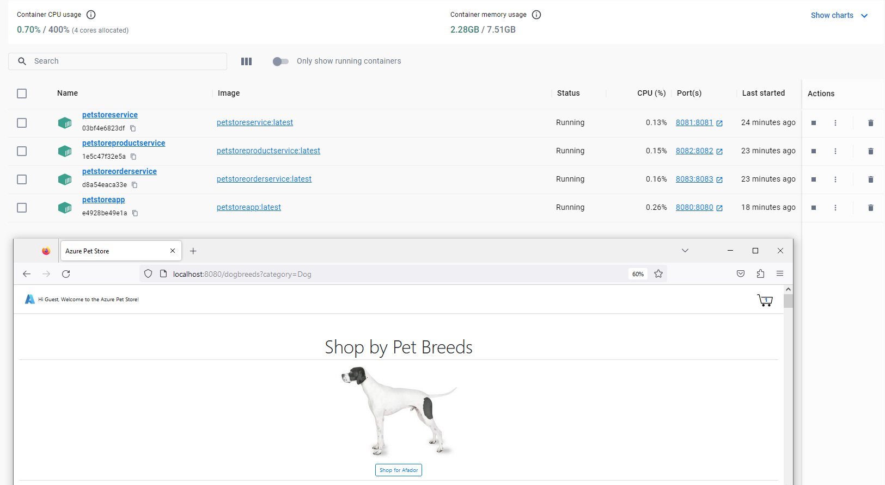
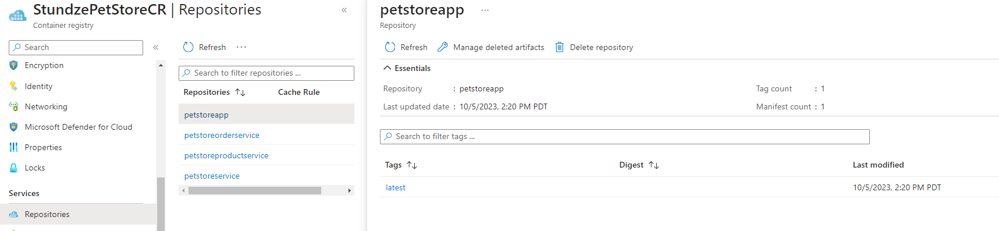
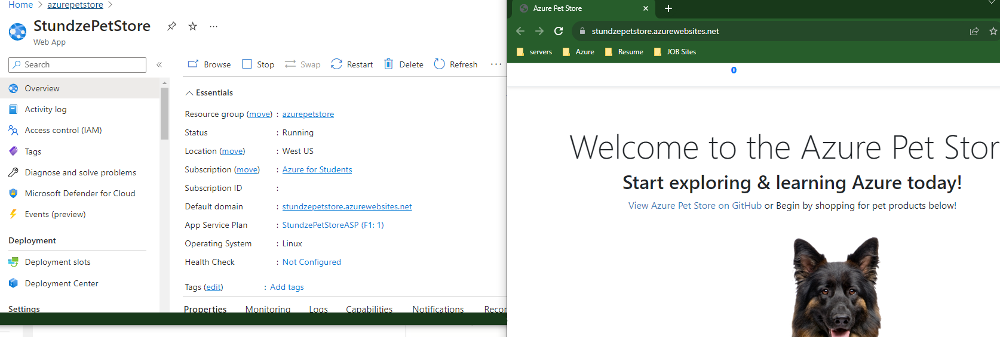
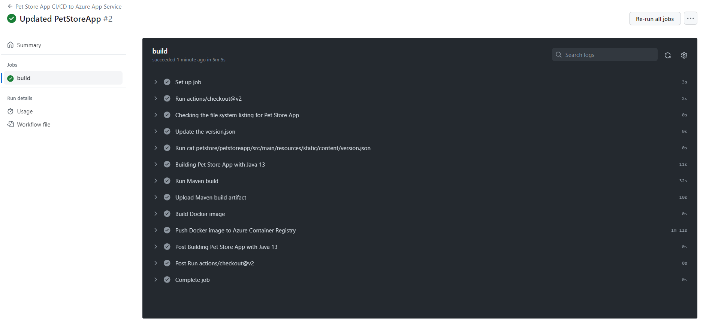
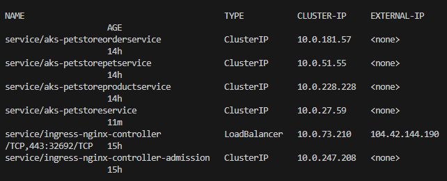
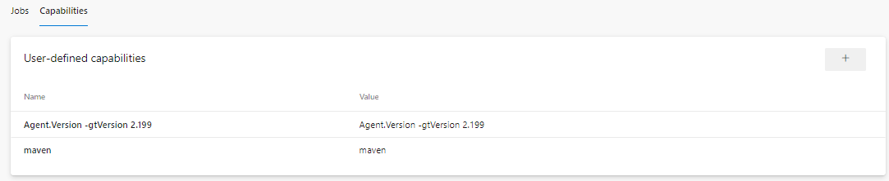

# Stundze Pet Store
My azure Pet store project

## Project Notes
### [Step 0](petstore/00-setup-your-environment/README.md)
- [Documentation to create an Azure Button to deploy a template](https://learn.microsoft.com/en-us/azure/azure-resource-manager/templates/deploy-to-azure-button)
- [Adding Images to ReadME](https://www.educative.io/answers/adding-images-to-readmemd-in-github) 
- Azure button isn't currently supported for bicep so this is the ARM Template, I have converted the template to the free linux tier. 

### [Step 1](petstore/01-build-the-docker-images/README.md)
- [Query IP of container from CLI](https://docs.docker.com/engine/reference/commandline/inspect/)
    - the command to query the container included a typo by calling the container image instead of the container name, use the container name without the ':Latest'

### [Step 2](petstore/02-push-the-docker-images-to-acr/README.md)

### [Step 3](petstore/03-configure-app-service-for-cd/README.md)

### [Step 4](petstore/04-configure-git-hub-action-for-ci-cd-into-app-service/README.md)

### [Step 5](petstore/05-create-an-azure-k8s-cluster/README.md)
- [Video on what is Helm](https://www.youtube.com/watch?v=-ykwb1d0DXU)
- [How to Install Helm on windows](https://phoenixnap.com/kb/install-helm)
- [How to delete hellm namespace](https://phoenixnap.com/kb/helm-delete-deployment-namespace)
    - I Had to restart the helm commands after there were some typos in the commands

### [step 6](petstore/06-configure-ado-pipeline-for-ci-cd-into-aks/README.md)
Due to the limitations of a free DevOPs account i encountered error "No hosted parallelism has been purchased or granted" I found a workaround by creating an agent pool on my computer:
- [Azure Pipelines agents](https://learn.microsoft.com/en-us/azure/devops/pipelines/agents/agents?view=azure-devops&tabs=yaml%2Cbrowser)
- [Install Azure Pipelines agent on personal computer](https://learn.microsoft.com/en-us/azure/devops/pipelines/agents/windows-agent?view=azure-devops)
-[Learn Module for setting up an AzureDevOPs personal Agent](https://learn.microsoft.com/en-us/training/modules/host-build-agent/4-create-build-agent)
- Inorder to route the project to your Personal Agent Enable the following User Defind Capabilities on in Azure DevOPs (for this project):
    - 1. 'maven' 2. 'Agent.Version -gtVersion 2.199'

## Additional Notes
- [convert JSON to Bicep](https://learn.microsoft.com/en-us/azure/azure-resource-manager/bicep/decompile?tabs=azure-cli)
    - I used this to practice writing and reading bicep files
- I converted [this](https://github.com/benajii/azure-petstore/blob/main/bicepfiles/template.json) template to Bicep and included parameters for Names and region, see all deployment files in the [bicep folder](https://github.com/benajii/azure-petstore/tree/main/bicepfiles)

## Acknowledgements 
- This educational project was created by [chtrembl](https://chtrembl.github.io/azure-cloud/petstore/). Thank you for the opportunity to learn.