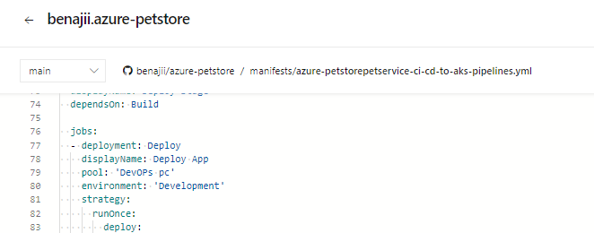
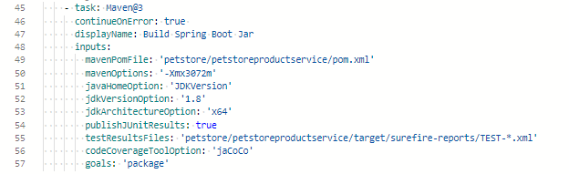
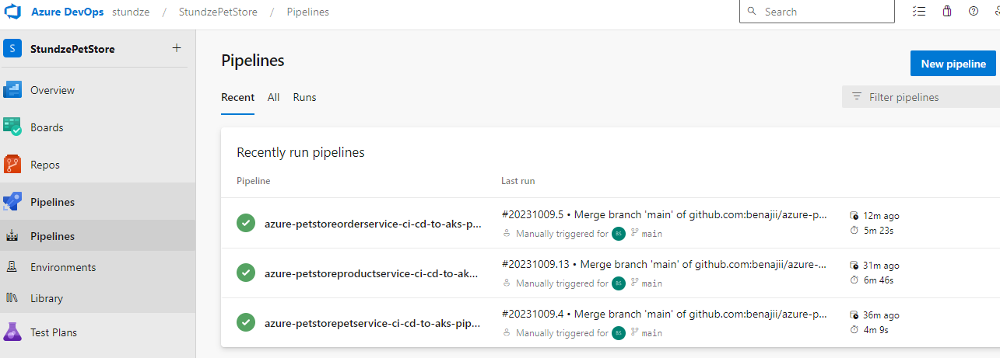
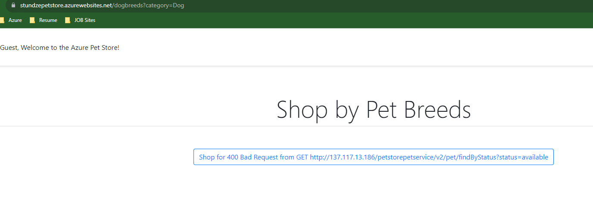
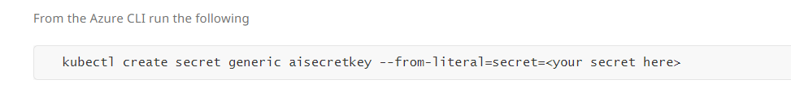
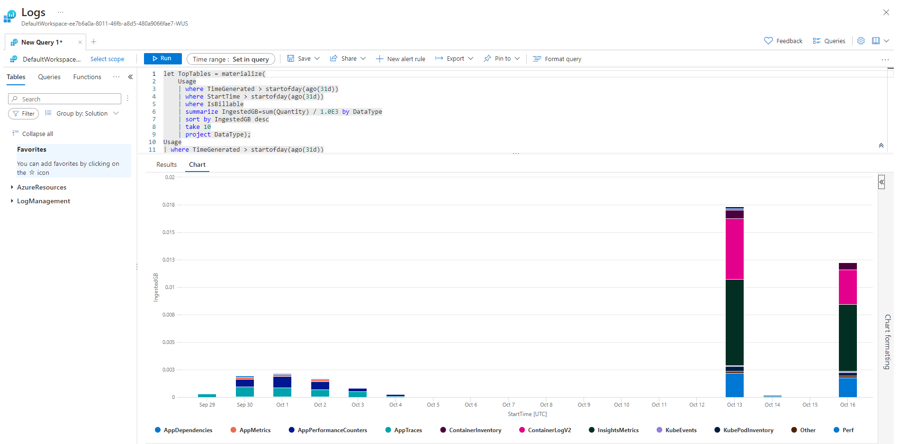

# Stundze Pet Store
My azure Pet store project

## Project Notes
### [Step 0](petstore/00-setup-your-environment/README.md)
- [Documentation to create an Azure Button to deploy a template](https://learn.microsoft.com/en-us/azure/azure-resource-manager/templates/deploy-to-azure-button)
- [Adding Images to ReadME](https://www.educative.io/answers/adding-images-to-readmemd-in-github) 
- Azure button isn't currently supported for bicep so this is the ARM Template, I have converted the template to the free Linux tier. 

### [Step 1](petstore/01-build-the-docker-images/README.md)
- [Query IP of container from CLI](https://docs.docker.com/engine/reference/commandline/inspect/)
    - the command to query the container included a typo by calling the container image instead of the container name, use the container name without the ':Latest'

### [Step 2](petstore/02-push-the-docker-images-to-acr/README.md)

### [Step 3](petstore/03-configure-app-service-for-cd/README.md)
- To reduce costs I:
    - deployed a Basic tier App Service Plan
    - Shut down the App when not in use

### [Step 4](petstore/04-configure-git-hub-action-for-ci-cd-into-app-service/README.md)

### [Step 5](petstore/05-create-an-azure-k8s-cluster/README.md)
- In order to reduce costs I:
    - deployed a free tier AKS
    - used a vm image that didn't support premium storage, this reduced my at-rest costs
    - Shutdown the AKS when not in use
- [Video on what is Helm](https://www.youtube.com/watch?v=-ykwb1d0DXU)
- [How to Install Helm on windows](https://phoenixnap.com/kb/install-helm)
- [How to delete helm namespace](https://phoenixnap.com/kb/helm-delete-deployment-namespace)
    - I had to restart the helm commands after there were some typos in the commands

- I added extra HPA rules, inorder to remove them use [Kubectl delete HPA](https://stackoverflow.com/questions/39856927/how-to-turn-off-autoscaling-in-kubernetes-with-the-kubectl-command)

### [step 6](petstore/06-configure-ado-pipeline-for-ci-cd-into-aks/README.md)
Due to the limitations of a free DevOPs account I encountered error "No hosted parallelism has been purchased or granted" I found a workaround by creating an agent pool on my computer:
- [Azure Pipelines agents](https://learn.microsoft.com/en-us/azure/devops/pipelines/agents/agents?view=azure-devops&tabs=yaml%2Cbrowser)
- [Install Azure Pipelines agent on personal computer](https://learn.microsoft.com/en-us/azure/devops/pipelines/agents/windows-agent?view=azure-devops)
- [Learn Module for setting up an AzureDevOPs personal Agent](https://learn.microsoft.com/en-us/training/modules/host-build-agent/4-create-build-agent)
- In order to route the project to your Personal Agent Add these user defined capabilities in Project Settings>agent pools>[your Agent Pool]>[your Agent Name]>Capabilities>User Defined Capabilities:
    - 'maven'
    - 'Agent.Version -gtVersion 2.199'

- In your Pipeline you will have to target your Agent pool, my personal agent pool was 'Dev Ops pc'

- To process maven tasks/Spring boot for this specific project, you need to Install [Java 1.8 x64](https://codenotfound.com/java-download-install-jdk-8-windows.html), [Download Maven](https://maven.apache.org/download.cgi) and [Install Maven](https://maven.apache.org/install.html). You will also have to configure your maven task as shown below

- Be sure to run the agent on your computer before running the pipeline on Azure DevOps, otherwise your agent pool will be off-line
- Be sure to run Docker to enable Docker engine for your job so the pipeline can build the Docker images
- I reduced the memory size on my containers in half, see deployment.yaml. The free tier of AKS only supports a node pool with 8 cpu core which for my image was 2 nodes. I ran out of memory and was unable to scale out.

[Step 7](petstore/07-connect-petstoreapp-and-petstoreservice-together/README.md)
- This step resulted in a 400 Bad Request error
- I was unable to resolve the issue, Its either and issue with the loadbalencer or the service tiers i chose

[Step 8](petstore/08-configure-apps-to-use-application-insights/README.md).
- [AKS Secrets and namespace](https://stackoverflow.com/questions/46297949/sharing-secret-across-namespaces) As written the step below will make the secret but it will be in the default namespace and unavailable to your containers, they will fail to configure with secret not found. add '--namespace=<your namespace>' to add the secret to the correct namespace.

[Step 9](petstore/09-configure-apim-in-front-of-petstoreservice/README.m)

## Additional Notes
- [convert JSON to Bicep](https://learn.microsoft.com/en-us/azure/azure-resource-manager/bicep/decompile?tabs=azure-cli)
    - I used this to practice writing and reading bicep files
- I converted [this](https://github.com/benajii/azure-petstore/blob/main/bicepfiles/template.json) template to Bicep and included parameters for Names and region, see all deployment files in the [bicep folder](https://github.com/benajii/azure-petstore/tree/main/bicepfiles)

## Acknowledgements 
- This educational project was created by [chtrembl](https://chtrembl.github.io/azure-cloud/petstore/). Thank you for the opportunity to learn.
